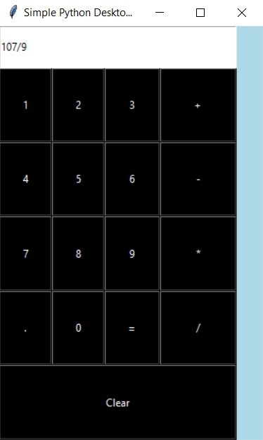
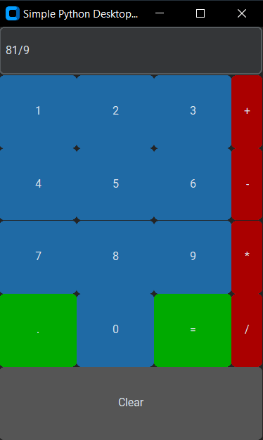

# Simple-Calculator_Python
## My first Python GUI Based calculator using Tkinter, a Python GUI library.

This GUI application was my *FIRST* application built in [Python TKinter](https://docs.python.org/3/library/tkinter.html). There is also a second version of the calculator in this repository that has an upraded version of the GUI. This second version is the same application but with [CustomTKinter](https://github.com/TomSchimansky/CustomTkinter) as it's GUI library.

#### Old Tkinter Calculator ####

#### CustomTKinter Calculator ####

